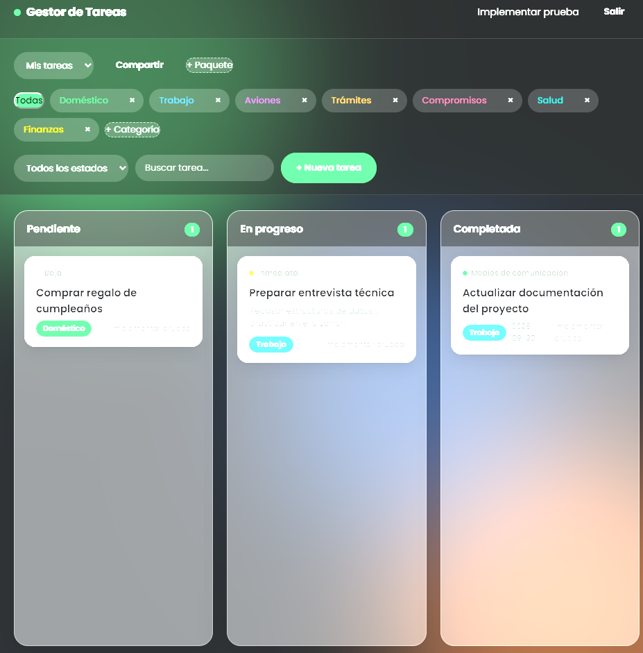
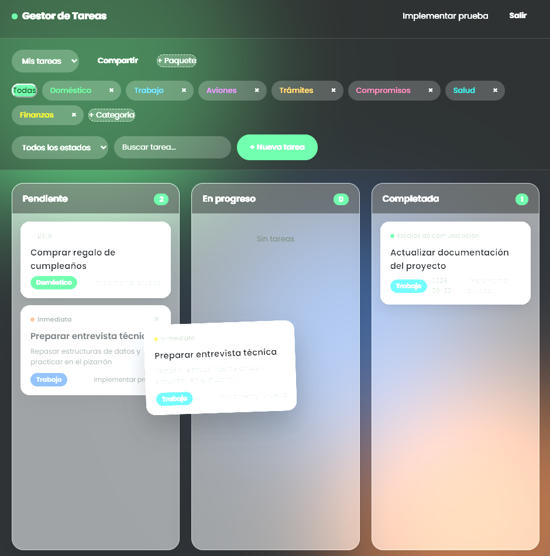
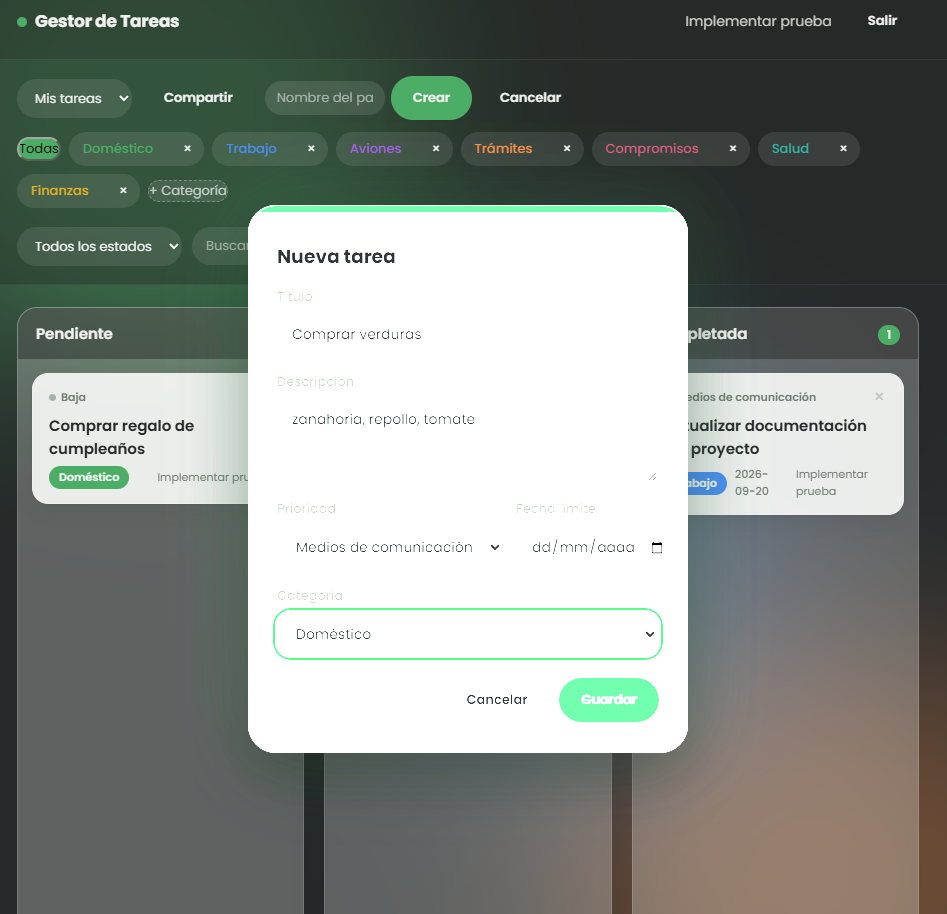

# Gestor de Tareas

Aplicación full-stack de gestión de tareas con autenticación, tablero Kanban
con drag & drop, categorías y paquetes de tareas compartidos por invitación.

### 🔗 [gestor-tareas-ecru-ten.vercel.app](https://gestor-tareas-ecru-ten.vercel.app)  ·  📄 [Documentación (Markdown)](docs/DOCUMENTACION.md)  ·  📕 [Documentación (PDF)](docs/DOCUMENTACION.pdf)



<table>
<tr>
<td></td>
<td></td>
</tr>
</table>

## Stack

- **Backend**: Java 21 + Spring Boot 4, Spring Data JPA, Spring Security (JWT), PostgreSQL
- **Frontend**: React + TypeScript (Vite), @dnd-kit para el drag & drop
- **Infraestructura**: Vercel (frontend), Railway (backend + PostgreSQL)

## Arquitectura

El backend sigue una arquitectura en capas clásica:

```
Controller  →  Service  →  Repository  →  Entity
   (HTTP)      (lógica)     (Spring       (JPA)
                             Data JPA)
```

con una capa de DTOs para no exponer las entidades directamente, y un filtro
JWT que intercepta las requests antes de llegar a los controllers.

## Funcionalidades

- [x] Registro / login de usuario (JWT)
- [x] CRUD de tareas
- [x] Tablero Kanban con drag & drop (persistente)
- [x] Categorías y prioridades (baja / media / inmediata)
- [x] Filtros por categoría, estado y búsqueda por texto
- [x] Paquetes de tareas compartidos: invitá a alguien por email para que
      vea, agregue, edite o elimine tareas del mismo paquete
- [x] Diseño responsive

## Cómo correrlo localmente

### Backend

Requiere PostgreSQL corriendo en `localhost:5432` con una base `gestor_tareas`
ya creada.

```bash
cd backend
DB_PASSWORD=tu_password ./mvnw spring-boot:run
```

Variables de entorno disponibles (todas opcionales, con default para desarrollo):

| Variable | Default |
|---|---|
| `DB_HOST` | `localhost` |
| `DB_PORT` | `5432` |
| `DB_NAME` | `gestor_tareas` |
| `DB_USER` | `postgres` |
| `DB_PASSWORD` | _(vacío)_ |
| `JWT_SECRET` | valor de desarrollo, **cambiar en producción** |
| `CORS_ALLOWED_ORIGIN` | `http://localhost:5173` |
| `PORT` | `8080` |

### Frontend

```bash
cd frontend
npm install
npm run dev
```

Por defecto apunta a `http://localhost:8080`. Para cambiarlo, definir
`VITE_API_URL` en un `.env` dentro de `frontend/`.

## Endpoints de la API

```
POST   /api/auth/registro
POST   /api/auth/login

GET    /api/paquetes
POST   /api/paquetes
DELETE /api/paquetes/{id}
GET    /api/paquetes/{id}/miembros
DELETE /api/paquetes/{id}/miembros/{usuarioId}
POST   /api/paquetes/{id}/invitaciones

GET    /api/invitaciones
POST   /api/invitaciones/{id}/aceptar
POST   /api/invitaciones/{id}/rechazar

GET    /api/categorias
POST   /api/categorias
DELETE /api/categorias/{id}

GET    /api/paquetes/{paqueteId}/tareas?estado=&categoriaId=&texto=
POST   /api/paquetes/{paqueteId}/tareas
PUT    /api/paquetes/{paqueteId}/tareas/{id}
PATCH  /api/paquetes/{paqueteId}/tareas/{id}/mover
DELETE /api/paquetes/{paqueteId}/tareas/{id}
```

Todos los endpoints (excepto `/api/auth/**`) requieren un header
`Authorization: Bearer <token>`. Las rutas de paquetes y tareas verifican
que el usuario sea miembro del paquete antes de permitir el acceso.
