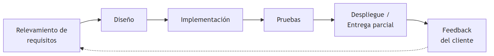
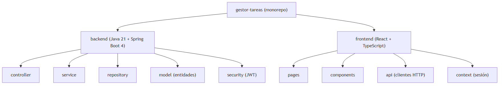
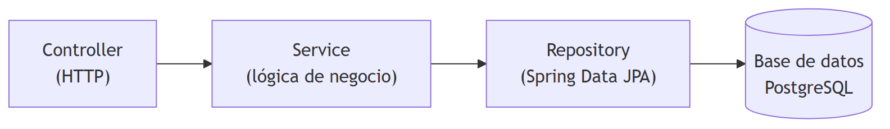
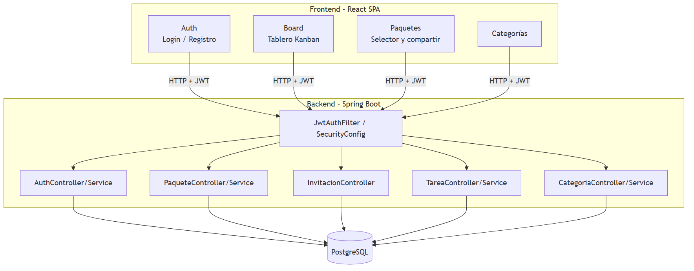
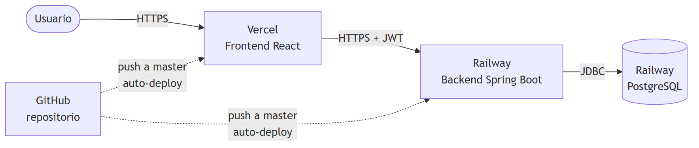
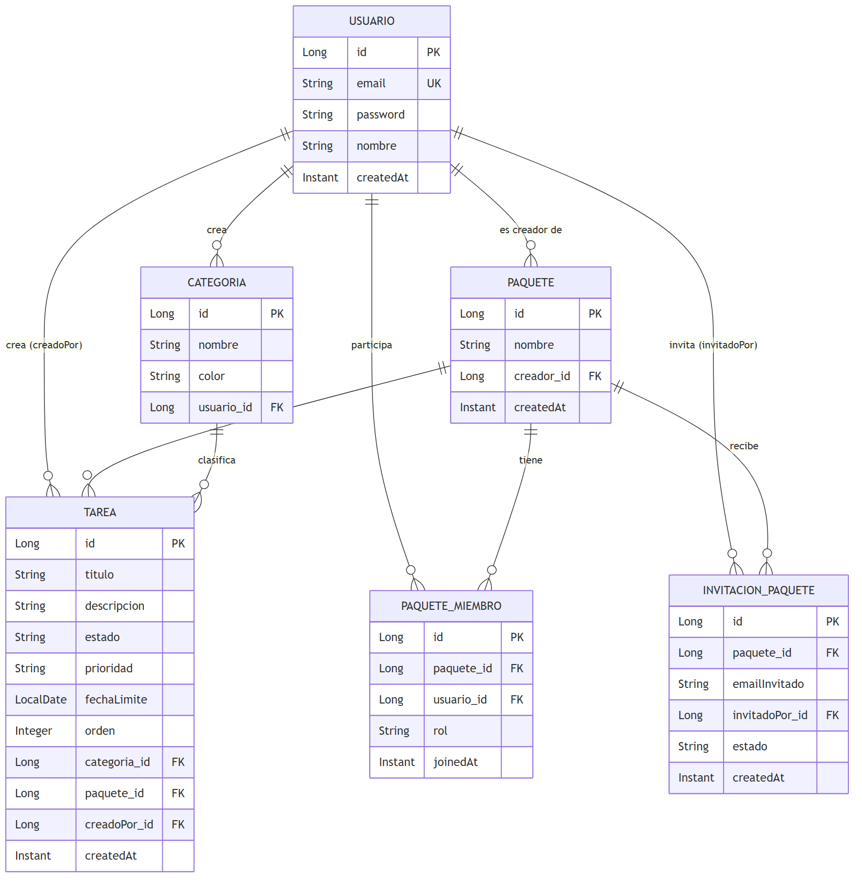
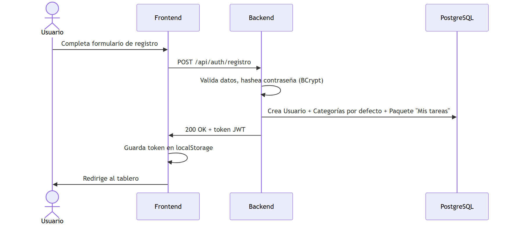
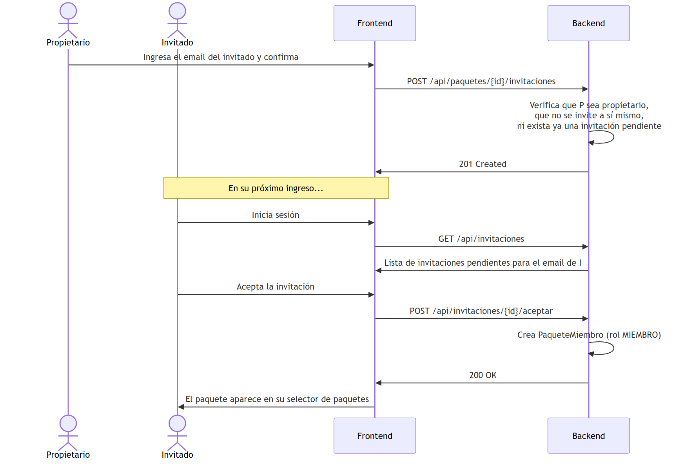
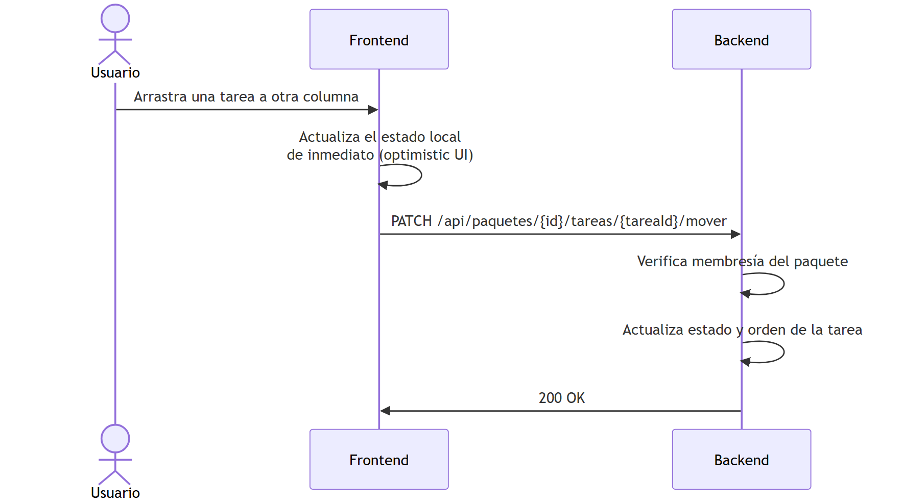

<div class="cover">

# Documentación del Proyecto
## Gestor de Tareas

<div class="cover-meta">

**Cliente:** Estudio Cronos (consultora freelance de diseño y desarrollo)

**Proveedor:** German Giorgis — Desarrollo de software

**Versión del documento:** 1.0

**Fecha:** Septiembre 2026

</div>
</div>

---

## Índice

1. [Definición general del proyecto](#1-definición-general-del-proyecto)
2. [Especificación de requerimientos](#2-especificación-de-requerimientos)
3. [Ciclo de vida del proyecto](#3-ciclo-de-vida-del-proyecto)
4. [Arquitectura del sistema](#4-arquitectura-del-sistema)
5. [Diseño del modelo de datos](#5-diseño-del-modelo-de-datos)
6. [Descripción de procesos y servicios](#6-descripción-de-procesos-y-servicios)
7. [Documentación técnica — Especificación de API](#7-documentación-técnica--especificación-de-api)
8. [Procedimientos de instalación y despliegue](#8-procedimientos-de-instalación-y-despliegue)
9. [Especificaciones de prueba](#9-especificaciones-de-prueba)
10. [Conclusiones](#10-conclusiones)

---

## 1. Definición general del proyecto

### 1.1. Contexto

Estudio Cronos es una consultora freelance de diseño y desarrollo compuesta por 4 integrantes
fijos que además trabaja habitualmente con colaboradores externos y clientes que se suman
puntualmente a distintos proyectos. Hasta ahora coordinaban sus tareas con planillas
compartidas y mensajes de chat, lo que generaba pérdida de información y tareas duplicadas o
sin dueño claro. Evaluaron herramientas corporativas de gestión de tareas (Trello, Asana) pero
las licencias por usuario para dar acceso a clientes externos en cada proyecto resultaban
costosas para su volumen de trabajo.

Nos encargaron el desarrollo de una aplicación web propia, liviana, que cubra lo esencial de un
tablero Kanban con la posibilidad de compartir el trabajo de un proyecto puntual con quien haga
falta, sin límites de usuarios ni costos de licencia.

### 1.2. Idea general

**Gestor de Tareas** es una aplicación web de gestión de tareas personales y compartidas,
organizada en tableros Kanban (Pendiente / En progreso / Completada). Cada usuario puede
agrupar sus tareas en **paquetes** — equivalentes a un proyecto o cliente — e invitar a otras
personas a un paquete puntual por correo electrónico, sin necesidad de compartir toda su cuenta
ni el resto de sus tareas.

### 1.3. Objetivos

- Centralizar la gestión de tareas de cada integrante del estudio en un único lugar.
- Permitir compartir el trabajo de un proyecto específico con colaboradores externos o clientes,
  sin exponer el resto de las tareas del usuario.
- Ofrecer una experiencia visual simple (tablero Kanban con drag & drop) que no requiera
  capacitación previa.
- Mantener el costo de operación en cero o casi cero, utilizando planes gratuitos de
  infraestructura en la nube.

### 1.4. Usuarios

| Tipo de usuario | Descripción | Nivel de experiencia esperado |
|---|---|---|
| Integrante del estudio | Usuario habitual, crea y administra sus propios paquetes de tareas | Usuario de computadora sin conocimientos técnicos |
| Colaborador / cliente invitado | Se suma a un paquete puntual por invitación, sin necesidad de pertenecer al estudio | Usuario de computadora sin conocimientos técnicos |

El presente informe está dirigido a un lector con conocimientos generales de desarrollo de
software (arquitectura cliente-servidor, bases de datos relacionales, APIs REST), sin requerir
experiencia previa en el stack específico utilizado.

---

## 2. Especificación de requerimientos

### 2.1. Requisitos generales (pautas del cliente)

- La aplicación debe ser accesible desde el navegador, sin instalación de software adicional.
- Debe permitir agrupar tareas por proyecto/cliente, de forma independiente entre sí.
- Debe permitir compartir el acceso a un grupo de tareas puntual con otra persona, usando
  únicamente su email, sin límite de invitados.
- Debe ofrecer una vista de tablero (Kanban) con arrastrar y soltar para cambiar el estado de
  una tarea.
- Debe permitir clasificar tareas por categoría y prioridad.
- El costo de infraestructura debe mantenerse dentro de planes gratuitos, dado el volumen de
  uso esperado (uso interno de un estudio pequeño).
- El proyecto es de desarrollo **original**: no parte de ningún sistema preexistente ni es
  continuación de un desarrollo anterior.

### 2.2. Requisitos funcionales

| ID | Requisito |
|---|---|
| RF-01 | El sistema debe permitir registrar una cuenta de usuario con nombre, email y contraseña. |
| RF-02 | El sistema debe permitir iniciar sesión con email y contraseña, devolviendo una sesión autenticada (token). |
| RF-03 | El sistema debe permitir cerrar sesión. |
| RF-04 | El sistema debe crear automáticamente un paquete de tareas por defecto ("Mis tareas") al registrarse. |
| RF-05 | El usuario debe poder crear nuevos paquetes de tareas adicionales. |
| RF-06 | El usuario debe poder listar todos los paquetes de los que es propietario o miembro. |
| RF-07 | El propietario de un paquete debe poder eliminarlo. |
| RF-08 | El propietario de un paquete debe poder invitar a otra persona por email. |
| RF-09 | El sistema debe rechazar invitaciones duplicadas o dirigidas al propio propietario. |
| RF-10 | El usuario invitado debe poder ver sus invitaciones pendientes. |
| RF-11 | El usuario invitado debe poder aceptar o rechazar una invitación. |
| RF-12 | El propietario de un paquete debe poder ver la lista de miembros y remover a alguno (excepto a sí mismo). |
| RF-13 | Cualquier miembro de un paquete debe poder crear tareas dentro de él. |
| RF-14 | Cualquier miembro de un paquete debe poder editar (título, descripción, prioridad, fecha límite, categoría) o eliminar cualquier tarea del paquete. |
| RF-15 | El sistema debe registrar y mostrar qué usuario creó cada tarea. |
| RF-16 | El usuario debe poder cambiar el estado de una tarea (Pendiente / En progreso / Completada) arrastrándola entre columnas, conservando el orden dentro de cada columna. |
| RF-17 | El usuario debe poder filtrar las tareas visibles por categoría, por estado y por texto libre en el título. |
| RF-18 | El usuario debe poder crear y eliminar categorías propias, cada una con un nombre y un color. |
| RF-19 | Un usuario que no sea miembro de un paquete no debe poder ver ni modificar sus tareas. |

### 2.3. Requisitos no funcionales

| ID | Requisito |
|---|---|
| RNF-01 (Seguridad) | Las contraseñas deben almacenarse hasheadas (nunca en texto plano). El acceso a los datos debe requerir autenticación mediante token, y validarse la pertenencia a un paquete antes de exponer sus tareas. |
| RNF-02 (Usabilidad) | La interfaz debe ser utilizable sin capacitación previa y debe adaptarse a pantallas de escritorio y móviles (diseño responsive). |
| RNF-03 (Disponibilidad) | La aplicación debe estar accesible públicamente en internet las 24 horas, sin depender de que un equipo local esté encendido. |
| RNF-04 (Portabilidad) | El frontend debe funcionar en los navegadores modernos más utilizados (Chrome, Edge, Firefox) sin plugins adicionales. |
| RNF-05 (Rendimiento) | Las operaciones habituales (crear, editar, mover una tarea) deben reflejarse en la interfaz de forma inmediata (optimistic UI), sin esperar la confirmación del servidor para sentirse fluidas. |
| RNF-06 (Mantenibilidad) | El código debe organizarse en capas (Controller / Service / Repository) y el frontend en componentes reutilizables, para facilitar la incorporación de nuevas funcionalidades. |
| RNF-07 (Costo) | La infraestructura de hosting debe operar dentro de planes gratuitos, acorde al volumen de uso de un estudio de pocas personas. |

### 2.4. Información de autoría y legacy

El proyecto es un desarrollo **original**, sin relación con sistemas preexistentes del cliente.
No existen versiones anteriores ni requisitos de retro-compatibilidad.

### 2.5. Alcance y limitaciones

**Incluido en el alcance:**

- Registro, login e identificación de usuarios.
- Tableros Kanban con tareas, categorías y prioridades.
- Paquetes de tareas con miembros e invitaciones por email.
- Filtros de búsqueda y despliegue en producción accesible públicamente.

**Fuera de alcance (no implementado en esta versión):**

- Envío de notificaciones reales por correo electrónico (las invitaciones se ven dentro de la
  aplicación, no se envía un email al invitado).
- Recuperación de contraseña olvidada.
- Edición del perfil de usuario (nombre, email, contraseña) luego del registro.
- Roles diferenciados más allá de "propietario" y "miembro" dentro de un paquete (por ejemplo,
  permisos de solo lectura).
- Papelera o recuperación de tareas eliminadas.
- Aplicación móvil nativa (solo se ofrece la versión web responsive).

---

## 3. Ciclo de vida del proyecto

Se adoptó un modelo de desarrollo **iterativo e incremental**: en cada iteración se entregó una
versión funcional del sistema, se recogió feedback del cliente (simulado, en base a los
requisitos iniciales) y se ajustó tanto el diseño visual como el alcance funcional antes de
avanzar a la siguiente iteración. Este enfoque se eligió por sobre un modelo en cascada porque
el cliente no tenía definida de antemano la identidad visual de la aplicación, y porque la
funcionalidad de paquetes compartidos surgió como una ampliación posterior al primer entregable.



### Iteraciones realizadas

| Iteración | Entregable |
|---|---|
| 1 — MVP | Autenticación (registro/login con JWT), CRUD de tareas, categorías propias, tablero Kanban con drag & drop persistente, filtros. |
| 2 — Identidad visual | Tres rondas de ajuste de diseño en base a feedback estético del cliente, hasta llegar a un estilo definitivo (glassmorphism con fondo difuminado animado) y hacerlo responsive para dispositivos móviles. |
| 3 — Colaboración | Incorporación de paquetes de tareas, membresías e invitaciones por email; migración del modelo de datos de "tareas por usuario" a "tareas por paquete". |
| 4 — Despliegue y documentación | Publicación en infraestructura en la nube (frontend, backend y base de datos), corrección de errores de configuración de producción, y elaboración de esta documentación. |

---

## 4. Arquitectura del sistema

### 4.1. Descripción jerárquica

El proyecto se organiza como un **monorepo** con dos aplicaciones independientes que se
despliegan por separado:

```
gestor-tareas/
├── backend/     → API REST (Java 21 + Spring Boot 4)
└── frontend/    → SPA (React 18 + TypeScript + Vite)
```



El backend sigue una arquitectura en capas clásica:



con una capa de DTOs que evita exponer las entidades JPA directamente en las respuestas HTTP, y
un filtro (`JwtAuthFilter`) que intercepta cada request para validar el token antes de que
llegue al controller correspondiente.

### 4.2. Diagrama de módulos



### 4.3. Descripción individual de los módulos

**Auth (backend: `AuthController` / `AuthService`)**
- *Propósito:* registrar usuarios nuevos e iniciar sesión.
- *Responsabilidad:* validar credenciales, hashear contraseñas (BCrypt), emitir tokens JWT. Al
  registrar un usuario también crea sus categorías por defecto y su paquete "Mis tareas".
- *Dependencias:* `UsuarioRepository`, `PasswordEncoder`, `JwtService`, `PaqueteService`.
- *Implementación:* `backend/src/main/java/.../controller/AuthController.java`,
  `service/AuthService.java`.

**Paquetes (backend: `PaqueteController` / `PaqueteService`)**
- *Propósito:* administrar los paquetes de tareas y sus miembros.
- *Responsabilidad:* crear/listar/eliminar paquetes, verificar membresía antes de dar acceso a
  las tareas de un paquete, gestionar invitaciones.
- *Dependencias:* `PaqueteRepository`, `PaqueteMiembroRepository`, `InvitacionPaqueteRepository`.
- *Implementación:* `controller/PaqueteController.java`, `service/PaqueteService.java`.

**Invitaciones (backend: `InvitacionController`)**
- *Propósito:* que un usuario invitado gestione sus invitaciones pendientes.
- *Responsabilidad:* listar invitaciones por email, aceptarlas (crea la membresía) o
  rechazarlas.
- *Dependencias:* `PaqueteService`, `InvitacionPaqueteRepository`.
- *Implementación:* `controller/InvitacionController.java`.

**Tareas (backend: `TareaController` / `TareaService`)**
- *Propósito:* CRUD de tareas dentro de un paquete.
- *Responsabilidad:* crear, editar, mover (cambiar estado/orden) y eliminar tareas,
  siempre verificando primero que el usuario sea miembro del paquete.
- *Dependencias:* `TareaRepository`, `PaqueteService`, `CategoriaRepository`.
- *Implementación:* `controller/TareaController.java`, `service/TareaService.java`.

**Categorías (backend: `CategoriaController` / `CategoriaService`)**
- *Propósito:* administrar las categorías personales de cada usuario (no son por paquete).
- *Responsabilidad:* crear/listar/eliminar categorías con nombre y color.
- *Implementación:* `controller/CategoriaController.java`.

**Seguridad (backend: `SecurityConfig`, `JwtAuthFilter`, `JwtService`)**
- *Propósito:* proteger todos los endpoints salvo `/api/auth/**`.
- *Responsabilidad:* validar el header `Authorization: Bearer <token>` en cada request,
  resolver el usuario autenticado, y configurar CORS para aceptar únicamente el origen del
  frontend desplegado.
- *Implementación:* `security/SecurityConfig.java`, `security/JwtAuthFilter.java`,
  `security/JwtService.java`.

**Board / Frontend (`BoardPage`, `KanbanBoard`, `TaskCard`, `TaskModal`)**
- *Propósito:* mostrar el tablero Kanban del paquete activo y permitir editar tareas.
- *Responsabilidad:* renderizar las tres columnas, manejar el drag & drop (librería
  `@dnd-kit`) y sincronizar el nuevo estado/orden con el backend.
- *Implementación:* `frontend/src/pages/BoardPage.tsx`, `components/KanbanBoard.tsx`.

**Paquetes / Frontend (`PackageSelector`, `ShareModal`, `PendingInvitations`)**
- *Propósito:* elegir el paquete activo, compartirlo e invitar colaboradores.
- *Implementación:* `frontend/src/components/PackageSelector.tsx`, `ShareModal.tsx`,
  `PendingInvitations.tsx`.

### 4.4. Dependencias externas

| Backend | Uso |
|---|---|
| Spring Boot (Web, Data JPA, Security, Validation) | Framework principal de la API REST |
| PostgreSQL Driver | Conexión a la base de datos |
| jjwt (0.12.6) | Generación y validación de tokens JWT |
| Lombok | Reducción de código repetitivo (getters/setters) |

| Frontend | Uso |
|---|---|
| React + TypeScript | Librería de UI y tipado estático |
| Vite | Bundler y servidor de desarrollo |
| React Router | Ruteo entre páginas (login, registro, tablero) |
| Axios | Cliente HTTP, con interceptores para adjuntar el token y manejar sesión expirada |
| @dnd-kit (core, sortable, utilities) | Drag & drop del tablero Kanban |

### 4.5. Tecnologías utilizadas y justificación

- **Java 21 + Spring Boot 4:** stack robusto y ampliamente documentado para APIs REST,
  con seguridad e inyección de dependencias integradas out-of-the-box.
- **PostgreSQL:** base de datos relacional, adecuada al modelo de datos fuertemente
  relacional del dominio (usuarios, paquetes, tareas, invitaciones).
- **React + TypeScript:** tipado estático que reduce errores en tiempo de desarrollo, y
  ecosistema maduro de librerías (como `@dnd-kit`) para interacciones complejas como el drag &
  drop.
- **JWT (stateless):** al no requerir sesiones en el servidor, simplifica el despliegue del
  backend en un servicio que puede reiniciarse sin perder sesiones activas.

### 4.6. Diagrama de despliegue



El frontend se publica en **Vercel** y el backend junto con la base de datos en **Railway**,
ambos conectados al mismo repositorio de GitHub con despliegue automático en cada `push` a la
rama `master`.

---

## 5. Diseño del modelo de datos

El modelo es **relacional**, gestionado mediante Spring Data JPA / Hibernate sobre PostgreSQL.

### 5.1. Diagrama entidad-relación



### 5.2. Datos de entrada, internos y de salida

- **Datos de entrada:** los que el usuario ingresa a través de los formularios del frontend
  (credenciales, título/descripción/prioridad de una tarea, nombre de un paquete, email a
  invitar).
- **Datos internos:** el estado persistido en PostgreSQL (tablas descriptas arriba), más el
  token JWT que viaja en cada request para identificar al usuario autenticado sin necesidad de
  consultar la base en cada validación de identidad.
- **Datos de salida:** las respuestas JSON de la API, moldeadas por DTOs específicos (por
  ejemplo `TareaResponse`, `PaqueteResponse`) que exponen únicamente los campos necesarios —
  nunca la entidad JPA completa ni el hash de la contraseña.

### 5.3. Reglas de integridad relevantes

- Un mismo usuario no puede ser miembro dos veces del mismo paquete (constraint único sobre
  `paquete_id` + `usuario_id`).
- Una tarea siempre pertenece a exactamente un paquete y tiene siempre un autor (`creadoPor`);
  ninguno de los dos campos es opcional a nivel de base de datos.
- Las categorías son propias de cada usuario (no se comparten entre miembros de un paquete),
  a diferencia de las tareas.

---

## 6. Descripción de procesos y servicios

### 6.1. Registro e inicio de sesión



Ante un error de validación (email inválido, contraseña débil, email ya registrado), el
backend devuelve un `400` con un detalle por campo, que el frontend muestra debajo de cada
input correspondiente.

### 6.2. Compartir un paquete e invitar a un colaborador



### 6.3. Mover una tarea entre columnas (drag & drop)



Se optó por actualizar la interfaz de inmediato y confirmar contra el servidor en segundo
plano (en lugar de esperar la respuesta) para que el tablero se sienta fluido durante el
arrastre, cumpliendo el requisito no funcional RNF-05.

---

## 7. Documentación técnica — Especificación de API

Todos los endpoints, salvo los de `/api/auth/**`, requieren el header
`Authorization: Bearer <token>`. Las rutas de paquetes y tareas verifican además que el
usuario autenticado sea miembro del paquete correspondiente; si no lo es, se responde `404`
(no `403`) para no revelar si el paquete existe.

### Autenticación

| Método | Ruta | Body | Respuesta |
|---|---|---|---|
| POST | `/api/auth/registro` | `{ nombre, email, password }` | `{ token, email, nombre }` |
| POST | `/api/auth/login` | `{ email, password }` | `{ token, email, nombre }` |

### Paquetes

| Método | Ruta | Body | Descripción |
|---|---|---|---|
| GET | `/api/paquetes` | — | Lista los paquetes del usuario (propios y donde es miembro) |
| POST | `/api/paquetes` | `{ nombre }` | Crea un nuevo paquete (el creador queda como PROPIETARIO) |
| DELETE | `/api/paquetes/{id}` | — | Elimina un paquete (solo propietario) |
| GET | `/api/paquetes/{id}/miembros` | — | Lista los miembros del paquete |
| DELETE | `/api/paquetes/{id}/miembros/{usuarioId}` | — | Remueve a un miembro (solo propietario) |
| POST | `/api/paquetes/{id}/invitaciones` | `{ email }` | Invita a un usuario por email (solo propietario) |

### Invitaciones

| Método | Ruta | Descripción |
|---|---|---|
| GET | `/api/invitaciones` | Invitaciones pendientes para el email del usuario autenticado |
| POST | `/api/invitaciones/{id}/aceptar` | Acepta la invitación (crea la membresía) |
| POST | `/api/invitaciones/{id}/rechazar` | Rechaza la invitación |

### Categorías

| Método | Ruta | Body | Descripción |
|---|---|---|---|
| GET | `/api/categorias` | — | Lista las categorías del usuario |
| POST | `/api/categorias` | `{ nombre, color }` | Crea una categoría |
| DELETE | `/api/categorias/{id}` | — | Elimina una categoría |

### Tareas (dentro de un paquete)

| Método | Ruta | Body | Descripción |
|---|---|---|---|
| GET | `/api/paquetes/{paqueteId}/tareas` | Query params: `estado`, `categoriaId`, `texto` | Lista/filtra las tareas del paquete |
| POST | `/api/paquetes/{paqueteId}/tareas` | `{ titulo, descripcion, prioridad, fechaLimite, categoriaId }` | Crea una tarea |
| PUT | `/api/paquetes/{paqueteId}/tareas/{id}` | ídem anterior + `estado` | Edita una tarea |
| PATCH | `/api/paquetes/{paqueteId}/tareas/{id}/mover` | `{ estado, orden }` | Cambia estado/orden (drag & drop) |
| DELETE | `/api/paquetes/{paqueteId}/tareas/{id}` | — | Elimina una tarea |

### Códigos de respuesta relevantes

| Código | Significado en este sistema |
|---|---|
| 200 / 201 | Operación exitosa |
| 400 | Error de validación (detalle por campo en `errores`) |
| 401 | No autenticado (token ausente, inválido o expirado) |
| 404 | Recurso inexistente **o** el usuario no es miembro del recurso solicitado |
| 409 | Conflicto (por ejemplo, invitación duplicada) |

---

## 8. Procedimientos de instalación y despliegue

### 8.1. Requisitos de la plataforma

- **Backend:** Java 21, Maven (incluido vía wrapper `./mvnw`), PostgreSQL 14+.
- **Frontend:** Node.js 18+, npm.

### 8.2. Obtención e instalación (entorno local)

```bash
git clone https://github.com/GermanGiorgis/gestor-tareas.git
cd gestor-tareas

# Backend (requiere PostgreSQL corriendo con una base "gestor_tareas")
cd backend
DB_PASSWORD=tu_password ./mvnw spring-boot:run

# Frontend, en otra terminal
cd frontend
npm install
npm run dev
```

Las variables de entorno del backend (host/puerto/usuario/contraseña de la base, secreto JWT,
origen CORS permitido) tienen valores por defecto aptos para desarrollo local; están detalladas
en el `README.md` del repositorio.

### 8.3. Despliegue en producción

La aplicación en producción está desplegada en:

- **Frontend:** [gestor-tareas-swart.vercel.app](https://gestor-tareas-swart.vercel.app) (Vercel)
- **Backend + base de datos:** Railway

Ambos servicios están conectados al repositorio de GitHub con despliegue automático: cada
`push` a la rama `master` dispara un build y una publicación nueva, sin intervención manual.

---

## 9. Especificaciones de prueba

Las pruebas se realizaron de forma **exploratoria**, simulando el comportamiento de un usuario
real sobre la aplicación desplegada, complementadas con verificación directa de los endpoints
mediante `curl` para los casos de control de acceso.

### 9.1. Casos de prueba ejecutados

| # | Caso | Resultado esperado | Resultado obtenido |
|---|---|---|---|
| 1 | Registro con email inválido | Error 400 con detalle en el campo email | ✅ Correcto |
| 2 | Registro con contraseña muy corta | Error 400 con detalle en el campo contraseña | ✅ Correcto |
| 3 | Login con credenciales incorrectas | Error 401 | ✅ Correcto |
| 4 | Crear tarea sin título | Error 400 (campo obligatorio) | ✅ Correcto |
| 5 | Mover una tarea entre columnas | La tarea persiste en su nueva columna tras recargar | ✅ Correcto |
| 6 | Invitar dos veces al mismo email a un paquete | Error 409 (invitación duplicada) | ✅ Correcto |
| 7 | Un usuario no miembro intenta acceder a las tareas de un paquete ajeno | 404 (no revela si el paquete existe) | ✅ Correcto |
| 8 | Acceso directo a una ruta interna (`/registro`) sin pasar por la home | Carga la página correcta, no un 404 | ✅ Correcto (tras corregir configuración de Vercel) |
| 9 | Formulario de nueva tarea, campo Prioridad | Debe listar Baja/Media/Inmediata | ⚠️ Defecto detectado (ver más abajo) |

### 9.2. Defecto conocido

Se detectó que, en ciertos casos, el campo **Prioridad** del formulario de nueva tarea muestra
un valor que no corresponde a ninguna de las tres opciones válidas del sistema. Queda
registrado como pendiente de corrección en una próxima iteración; no afecta la integridad de
los datos ya guardados, sólo el valor mostrado por defecto en el formulario.

---

## 10. Conclusiones

El desarrollo del Gestor de Tareas permitió cubrir la necesidad concreta planteada por el
cliente — coordinar tareas propias y compartidas con colaboradores externos, sin costo de
licenciamiento — utilizando un stack simple de mantener y con infraestructura de despliegue
gratuita.

**Complicaciones encontradas y cómo se resolvieron:**

- **Cambio del modelo de datos a mitad de proyecto:** al incorporar los paquetes compartidos,
  las tareas dejaron de pertenecer a un usuario para pasar a pertenecer a un paquete. Esto
  implicó migrar el esquema de la base de datos (agregar columnas obligatorias sobre una tabla
  con datos existentes), lo que se resolvió recreando la tabla en el entorno de desarrollo —
  una decisión aceptable en esta etapa por no tratarse aún de datos de producción.
- **Despliegue en dos plataformas distintas (Vercel + Railway):** al ser un monorepo, hubo que
  configurar explícitamente el directorio raíz de build en cada plataforma, y resolver
  discrepancias de puerto entre el proceso real del backend y el puerto expuesto públicamente
  por Railway.
- **Ruteo del lado del cliente en producción:** al ser una SPA con React Router, Vercel
  devolvía 404 ante un acceso directo a una ruta interna; se resolvió agregando una regla de
  reescritura (`vercel.json`) que redirige todo a `index.html`.

**Restricciones asumidas respecto al planteo original:** por tratarse de un proyecto de
portfolio con presupuesto de infraestructura nulo, se optó deliberadamente por no implementar
el envío real de emails de invitación (quedan visibles solo dentro de la aplicación), lo cual
sería el paso natural siguiente antes de un uso productivo real por parte de un cliente.

**Aspectos a futuro:** envío de invitaciones por correo real, recuperación de contraseña,
roles de solo lectura dentro de un paquete, tests automatizados (actualmente la verificación es
manual/exploratoria) y corrección del defecto detectado en el selector de prioridad.
